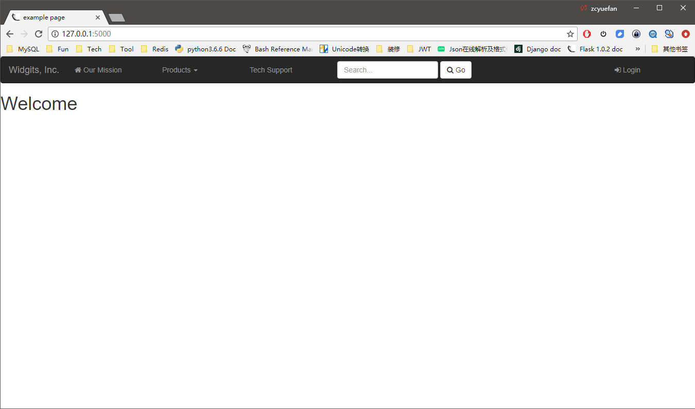

Flask-NavBar
=========

`Flask-Nav <https://github.com/mbr/flask-nav>`_ is a `Flask <http://flask.pocoo.org>`_-Extension to ease the creation
of navigational Elements in Applications. It provides means to Express the
Navigational structure and different ways to render these, making it easy to
custom tailor it for your application.

Flask-NavBar is an extended copy of Flask_nav 0.6.

Flask-NavBar extends features below:

    1. support setting a font-awesome icon before nav item;
    2. support inverse navbar;
    3. support fixed navbar;
    4. support navbar brand logo;
    5. support right-side navbar;
    6. support navbar search form.

app.py:

.. code-block:: python

    from flask import Flask
    from flask_navbar import Nav
    from flask_navbar.elements import *

    nav = Nav()

    # registers the "top" menubar
    nav.register_element('top', Navbar(
        View('Widgits, Inc.', 'index'),
        NavUl(
            View('Our Mission', 'about', icon='fa fa-comment'),
            Subgroup(
                'Products',
                View('Wg240-Series', 'products', product='wg240'),
                View('Wg250-Series', 'products', product='wg250'),
                Separator(),
                Text('Discontinued Products'),
                View('Wg10X', 'products', product='wg10x'),
            ),
            Link('Tech Support', 'http://techsupport.invalid/widgits_inc', icon='fa fa-home'),
            navbar_right=False
        ),
        Search('/search', navbar_right=True, icon='fa fa-search', btn_text='Go',
               input_placeholder='Search...', input_name='q', input_id='q', ),
        navbar_inverse=True,
        navbar_fixed='top',
        logo_filename='logo.png'
    ))

    app = Flask(__name__)
    # [...] (view definitions)

    # If using flask_bootstrap, nav must init first
    nav.init_app(app)

index.html:

.. code-block:: html

    <!doctype html>
    <html>
    <head>
    <title>{{msg|default('example page')}}</title>
    <link href="path/to/bootstrap/css/bootstrap.min.css" rel="stylesheet">
    <link rel="stylesheet" href="path/to/font-awesome/css/font-awesome.min.css">
    <link rel="stylesheet" href="path/to/font-awesome/css/font-awesome.min.css">
    <link rel="stylesheet" type="text/css" href="{{url_for('static', filename='base.css')}}">
    
    
    </head>
    <body>
      {{nav.top.render(id='top-navbar')}}
      <h1>{{msg|default('Welcome')}}</h1>
    </body>
    </html>

You can find a small, runnable example application inside the example folder. To run it,  execute:

.. code-block::

    # use `set FLASK_APP=example` on Windows
    export FLASK_APP=example
    flask run

Snapshot:

|image|

The `Flask-Nav full documentation <http://pythonhosted.org/flask-nav/>`_ can be found on PyPI.
